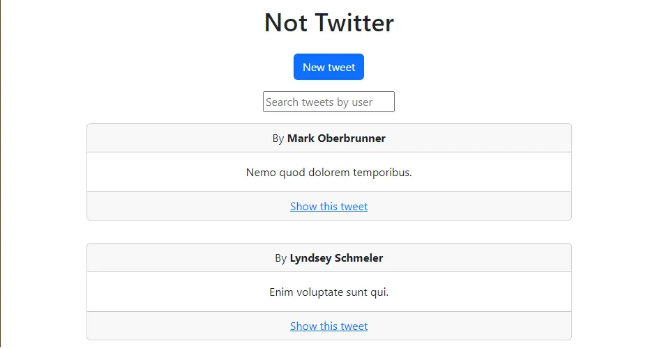
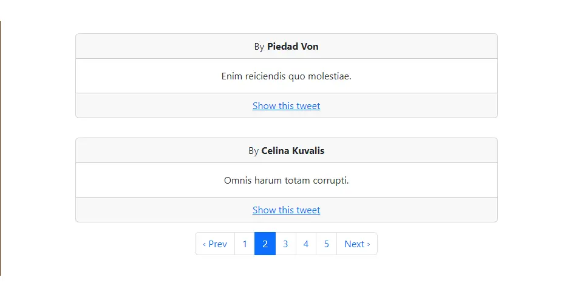
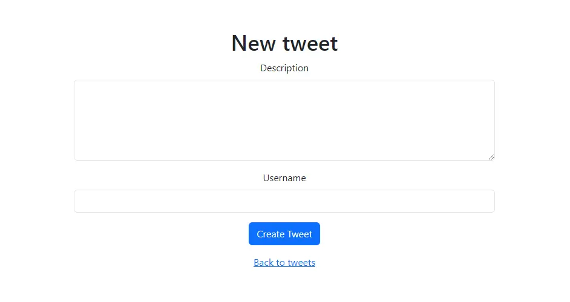

# Not Twitter

Clon de Twitter hecho con Ruby on Rails

## Descripción

Aplicación que busca simular el comportamiento de la red social Twitter para la prueba "Introducción a desarrollo de aplicaciones con Ruby on Rails".

A través de esta aplicación es posible crear, leer, editar y eliminar tweets.

## Vistas

### Index


### Paginación con Pagy


### Nuevo Tweet


### Vista de  Tweet


## Deployment en Heroku vía CLI

* Iniciar sesión con ```heroku login```
* Crear aplicación con ```heroku create```
* Conectar con la aplicación con ```heroku git:remote -a nombre_aplicación```
* Subir aplicación con ```git push heroku main```
* Ejecutar migración con ```heroku run rails db:migrate```
* Ejecutar seed de datos con ```heroku run rails db:seed```

## Software utilizado

Ruby 3.2.2  
Rails 7.0.5  
PostgreSQL 14.8  
Bootstrap 5.3  

### Gemas

Faker 3.2.0  
Pagy 6.0.4  
PgSearch 2.3.6  
